# WRD/PROBE: FIRST STEPS

# 1. INTRODUCTION

This document describes the setup and first steps with the WRD/Probe.

The battery-operated WRD/Probe offers up to 12 months of battery life without recharging. It can be used worldwide and can be connected to a development environment anywhere else in the world via a rendezvous service over the Internet.

This creates a virtual debug cable. It uses common standards and provides a GDB interface that integrates seamlessly into your familiar integrated development environment (IDE) such as VSCode or Eclipse. Starting the build process, setting a breakpoint, inspecting variables etc. remains the same.

And all this without compromising security: the WRD/Probe connects to your workstation via an encrypted end-to-end tunnel established with an out-of-band pairing with a flicker code

 

> :information_source: **Please note:**

>

> This document refers to a workstation running on **Windows** with **[VSCode](https://code.visualstudio.com/)** as IDE. Our example target device is the cellular IoT prototyping platform **[Nordic Thingy:91](https://www.nordicsemi.com/Products/Development-hardware/Nordic-Thingy-91)**, which uses an **Arm Cortex-M33 CPU**. We offer a simple **[example project (blinky.zip) in the same repository as this document](blinky.zip)**, to flash the firmware of the Thingy:91.

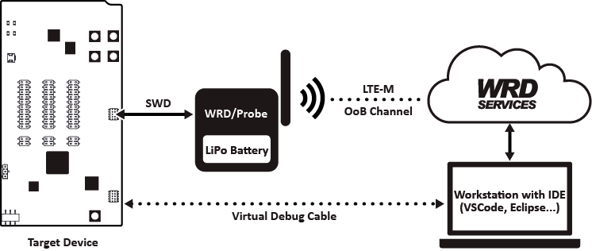

*Figure 1: The WRD/Probe connects target devices with an IDE*

## 1.1 Scope of Delivery

Please check the content of your WRD/Probe package:

+ 1x WRD/Probe

+ 1x LTE antenna

+ 1x USB-C cable

+ 1x Cortex-M adapter

+ 1x Jumper cable set

+ 4x Rubber feet

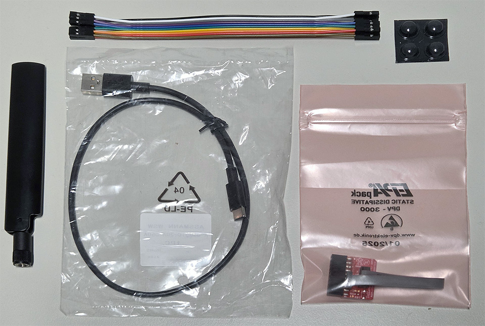

*Figure 2: WRD/Probe scope of delivery*

If anything is missing or defective, please contact our sales team: **sales@ssv-embedded.de**.

## 1.2 Required Equipment

The following equipment is required to work with the WRD/Probe:

+ A workstation with

    + Linux or Windows (version 10 or higher)

    + an Internet connection

    + an IDE like Eclipse or VSCode

    + a web browser (as UI for the **WRD/Client tool**)

[The WRD/Client tool can be downloaded from here: **https://www.ssv-embedded.de/downloads/wrd-client-win.zip**](https://www.ssv-embedded.de/downloads/wrd-client-win.zip).

## 1.3 Device Overview

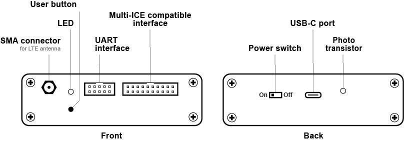

*Figure 3: Overview of the hardware elements*

# 2. SAFETY GUIDELINES

**Please read the following safety guidelines carefully! In case of property or personal damage by not paying attention to this document and/or by incorrect handling, we do not assume liability. In such cases any warranty claim expires.**

> :warning: **ATTENTION!**

>

> **OBSERVE PRECAUTIONS FOR HANDLING – ELECTROSTATIC SENSITIVE DEVICE!**

+ **The device is for indoor use only!**

7172737475767778798081828384858687888990919293949596979899100101102103104105106107108109110111112113114115116117118119120121122123124125126127128129130131132133134135136137138139140
+ **Do not expose the device to extreme temperatures, direct sunlight, extreme humidity or moisture. Avoid condensation at any time.**
+ **Installation, repair or maintenance – especially opening the device! – must only be carried out by qualified personnel.**

# 3. PREPARATIONS

## 3.1 Starting the WRD/Client

Download the **[WRD/Client](https://www.ssv-embedded.de/downloads/wrd-client-win.zip)**, unpack the ZIP file and execute the `client.bat`.

Then start a browser and open the address `localhost:8080` to display the user interface of the WRD/Client.

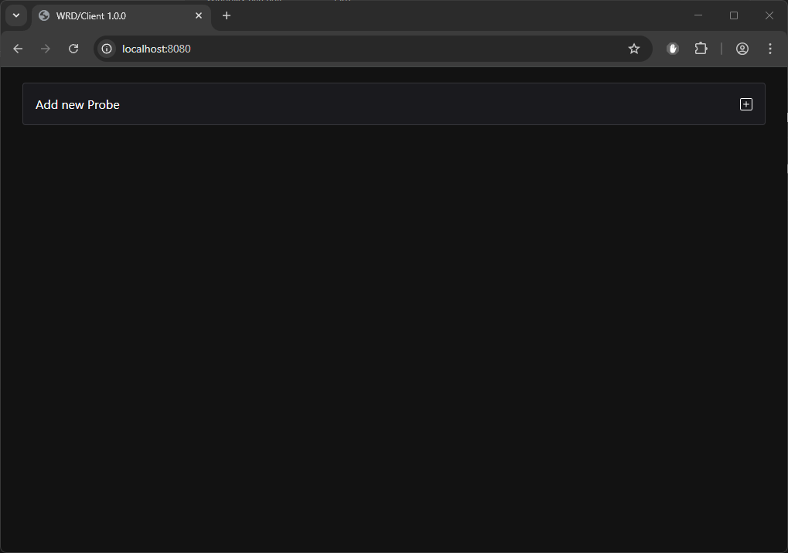

*Figure 4: UI of the WRD/Client*

## 3.2 Connecting the LTE Antenna

Connect the provided LTE antenna to the SMA connector of the WRD/Probe.

## 3.3 Switching on the WRD/Probe

Move the **power switch to the left** to power up the WRD/Probe. During the boot process, the **LED pulsates purple**. Once the WRD/Probe has finished booting up and is ready for operation, the **LED turns off**.

> :bulb: **TIP!**
>
> For energy saving reasons, the **power LED remains off** even when the WRD/Probe is switched on. Simply press the **`user` button** to check whether the WRD/Probe is switched on. The LED will turn on and displays the LTE signal quality for 30 seconds (red = bad signal quality > try to adjust the antenna, yellow = medium signal quality, green = good signal quality).


# 4. PAIRING A WORKSTATION

> :information_source: **Please note:**
>
> If the WRD/Probe has been paired before, the old pairing is deleted once a new pairing process has been finished successfully. The WRD/Client holding the old pairing is not notified, thus the respective WRD/Probe panel is not updated anymore.

Before starting the pairing process, ensure that the WRD/Probe has finished booting up (see chapter 3.3).

In the WRD/Client click the **plus symbol** to add the WRD/Probe. Therefore the WRD/Client displays a **flicker code**.

Then **press the `user` button** of the WRD/Probe for 4 seconds until the **LED slowly pulsates cyan**. This indicates the pairing mode.

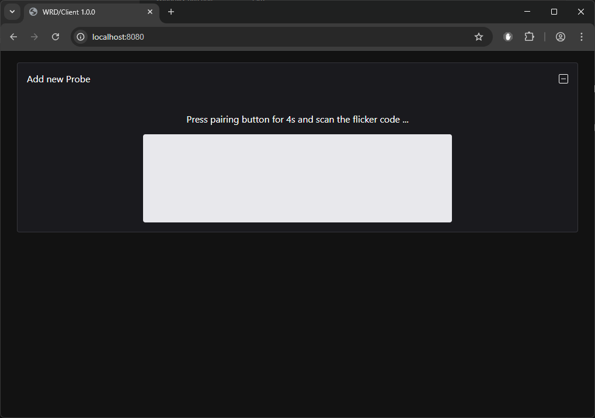

*Figure 5: WRD/Client displaying a flicker code*

Now hold the back side of the WRD/Probe with the foto transistor directly to the screen where the flicker code field is displayed. When the foto transistor receives the flicker code, the **LED rapidly pulsates cyan**. When the pairing process was successful, the **LED flashes 4 times green**.

**Congratulations! You successfully paired your workstation with the WRD/Probe.** :thumbsup:

> :information_source: **Please note:**
>
> When the pairing process failed, the **LED flashes 4 times red**. You can try again by pressing and holding the `user` button for 4 seconds. If the pairing fails several times, please check the **LTE connection status** by briefly pressing the `user` button and observing the LED color as described in **[chapter 11.4](#114-status-request)**. You can also try using **a different PC** for the pairing.

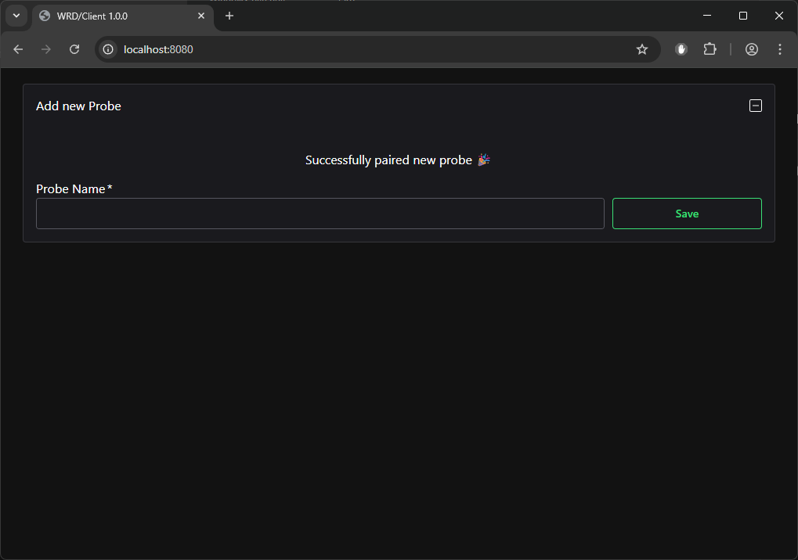

*Figure 6: Enter a name for the WRD/Probe*

After the pairing process the WRD/Client shows a **text field** to enter a name for the WRD/Probe. Enter a name and click the `Save` button.

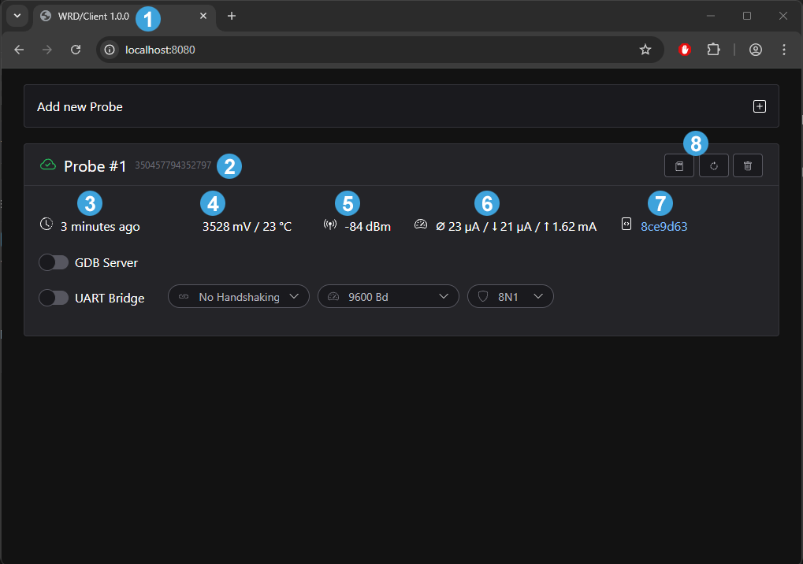

*Figure 7: WRD/Client displaying some status information*

After entering a name the following status information is displayed in the WRD/Client:

**1: WRD/Client version**

**2: Name:** The name you gave the WRD/Probe and its **serial number** are displayed here. You can also see the **connection status** of the WRD/Probe. If the WRD/Probe is connected to the rendezvous server, a **green cloud icon** is displayed.

**3: Time since last message:** The WRD/Probe automatically sends **every 5 minutes** current telemetry data. Pressing the `user` button also sends the current telemetry data. When you hover your mouse over the text, the exact time of the last message is displayed.
141142143144145146147148149150151152153154155156157158159160161162163164165166167168169170171172173174175176177178179180181182183184185186187188189190191192193194195196197198199200201202203204205206207208209210
**4: Current battery state & temperature:** This shows the current battery state as well as the internal temperature of the WRD/Probe. When you hover your mouse over the text, it will show whether the WRD/Probe is powered by the battery or via USB.

**5: Current LTE-M signal strength:** The higher (less negative) the value in dBm, the stronger the radio signal. Important for range and capacity planning: Areas with **-100 dBm and worse** are usually considered to be the edge of the radio cell and only provide low data rates.

**6: Target power monitoring:** The WRD/Probe measures the current consumption of the connected target every second. This section shows the average, minimum and maximum consumption over the last 60 minutes, which corresponds to 360 measurements.

**7: Fingerprint of last target firmware**: The fingerprint is updated every time you flash a new firmware onto the target.

**8: Buttons:**

+ 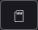 **Data volume:** Click this button to check the **remaining data volume** on the WRD/Probe SIM card. An email will be sent to **cellular@ssv-embedded.de**, and you will receive a reply at the email address you provided. Please also use this email address to **order additional data volume**.

+ 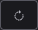 **Update:** Click this button to check if **new firmware** is available for the WRD/Probe. If so, simply follow the instructions.

+ 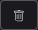 **Unpair:** Click this button to unpair the WRD/Probe.

# 5. ENABLING THE UART BRIDGE

To enable the UART bridge, simply click the **`UART Bridge` switch**. The UART bridge will then be enabled the next time telemetry data is sent. You can enable the UART bridge immediately by briefly pressing the `user` button. 

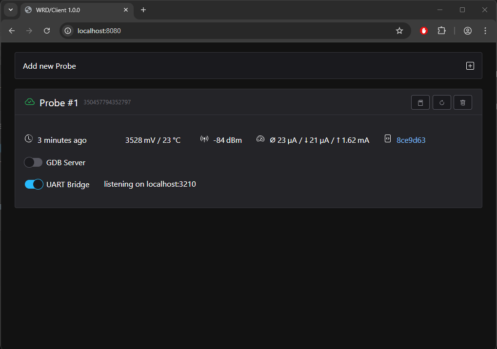

*Figure 8: Enabling the UART bridge*

## 5.1 Sending an Echo via Terminal

To check the UART connection between your workstation and the WRD/Probe without the WRD/Client, you can use a **terminal program** like PuTTY or TeraTerm and send an echo.

Therefore the following three jumpers must be set in the UART interface:

+ Jumper 1: **CTS + RTS**

+ Jumper 2: **RXD + TXD**

+ Jumper 3: **3.3V + VTuart**

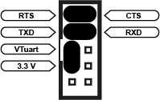

*Figure 9: Jumper settings for sending an echo via terminal*

Make sure that the **UART bridge** in the WRD/Client is enabled.

Now configure a terminal session in the terminal program with the following parameters:

+ Host name: **localhost**

+ Port: e.g. **3210** (number after localhost in the WRD/Client)

+ Connection type: **Raw**

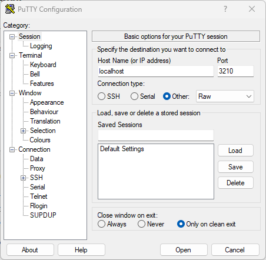

*Figure 10: Session settings for sending an echo via the terminal with PuTTY*

Start the terminal session and enter something like "test" or "echo" to test the echo. The WRD/Probe should respond within 5 seconds with the same string you sent.

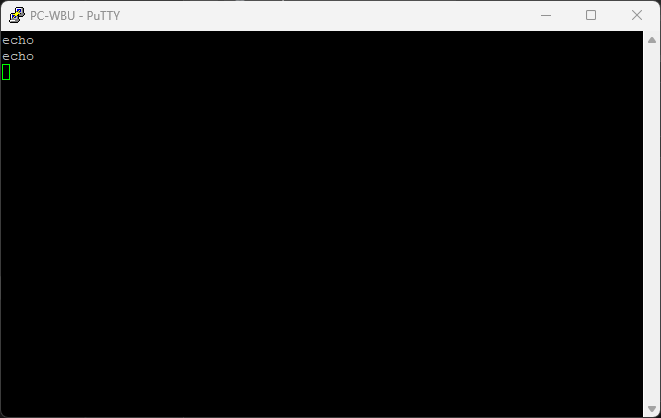

*Figure 11: Echo in terminal session*

# 6. ENABLING THE GDB SERVER

To enable the GDB server, simply click the **`GDB Server` switch**. The GDB server will then be enabled the next time telemetry data is sent. You can enable the GDB server immediately by briefly pressing the `user` button. 

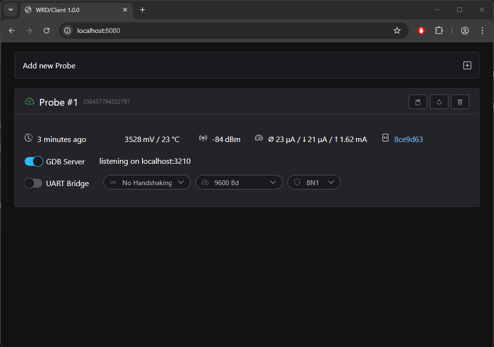

*Figure 12: Enabling the GDB server*

# 7. CONNECTING A TARGET DEVICE
211212213214215216217218219220221222223224225226227228229230231232233234235236237238239240241242243244245246247248249250251252253254255256257258259260261262263264265266267268269270271272273274275276277278279280
## 7.1 Connecting a Target via UART

There a different options of UART connections, depending on whether the target is supplied via the WRD/Probe or its own power source and whether the power consumption of the target is monitored or not.

> :information_source: **Please note**
>
> Please ensure that the UART bridge is enabled in the WRD/Client.

> :information_source: **IMPORTANT!**
>
> Please be sure to comply with the **absolute maximum ratings** described in the [**hardware reference (PDF)**](https://ssv-embedded.de/wrdprobe) in **chapter 6.1.2**.

---

### 7.1.1 Target with Own Power Supply, No Power Monitoring, 3.3 V I/O Voltage

Set a jumper on **VTuart** and **3.3V** if the target is independently powered.

The internal 3.3 V is used to power the output of the UART interface, hence it'll run on 3.3 V I/O voltage.

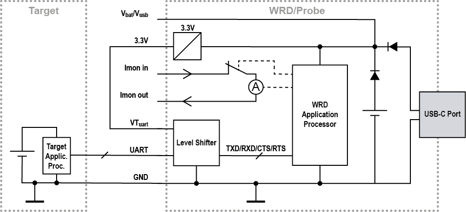

*Figure 13: UART connection for a target with own power supply, no power monitoring and 3.3 V I/O voltage*

---

### 7.1.2 Target with Own Power Supply, with Power Monitoring, max. 3.3 V I/O Voltage

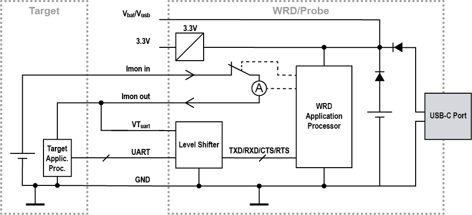

*Figure 14: UART connection for a target with own power supply, power monitoring and max. 3.3 V I/O voltage*

---

### 7.1.3 Target with Own Power Supply and Power Monitoring

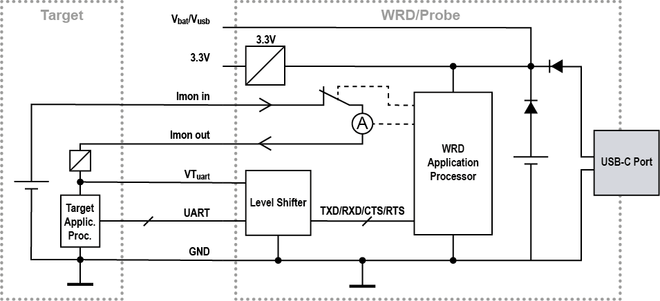

*Figure 15: UART connection for a target with own power supply and power monitoring*

---

### 7.1.4 Target with Power Supply via WRD/Probe @3.3..5.5 V and Power Monitoring

Set a jumper on **Vbat/Vusb** and **Imon in** to supply the target by the WRD/Probe with a voltage range of 3.3 V to 5.5 V and to enable power monitoring.


*Figure 16: UART connection for a target with power supply via WRD/Probe @3.3..5.5 V and power monitoring*

---

### 7.1.5 Target with Power Supply via WRD/Probe @3.3 V and Power Monitoring

Set a jumper on **3.3V** and **Imon in** to supply the target by the WRD/Probe with a voltage of 3.3 V and to enable power monitoring.

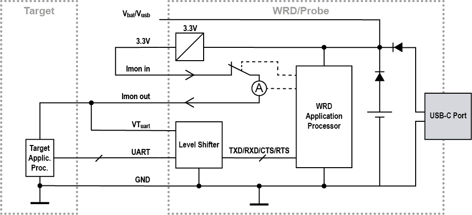

*Figure 17: UART connection for a target with power supply via WRD/Probe @3.3 V and power monitoring*

# 8. CONFIGURING VSCODE

To use the GDB protocol the workstation needs a GDB client. In this document we use the IDE **[VSCode](https://code.visualstudio.com/)** as GDB client. Make sure the GDB Server in the WRD/Client is enabled.

> :information_source: **Please note**
>
> Our example target device is the cellular IoT prototyping platform **[Nordic Thingy:91](https://www.nordicsemi.com/Products/Development-hardware/Nordic-Thingy-91)**, which uses an **Arm Cortex-M33 CPU**. This document describes all necessary configurations of VSCode for this particular target device. If you want to configure VScode for other manufacturers/architectures please refer to the respective manufacturer/provider.

## 8.1 Configuration for Cortex-M Devices
281282283284285286287288289290291292293294295296297298299300301302303304305306307308309310311312313314315316317318319320321322323324325326327328329330331332333334335336337338339340341342343344345346347348349350
To support Cortex-M debugging in VScode, the **Cortex-M debugger** extension must be installed.

To do this, open the **Extensions sidebar** in VSCode, search for **Cortex Debug**, and install the **Cortex-Debug** extension.

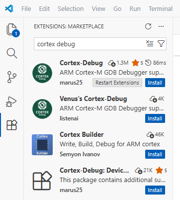

*Figure 18: Searching the Cortex-Debug extension*

## 8.2 Configuration for Nordic Cortex-M Devices

To support Nordic nRF devices in VScode, further extensions are necessary. The easiest way is to install the **nRF Connect for VS Code Extension Pack**. The nRF Connect Visual Studio Code Extension Pack includes custom-made extensions from Nordic Semiconductor and other extensions crucial for development with the nRF Connect SDK.

To do this, open the **Extensions sidebar** in VSCode, search for **nRF Connect**, and install the **nRF Connect for VS Code Extension Pack** extension. Click **Trust Publishers and Install** when prompted and confirm any further messages.

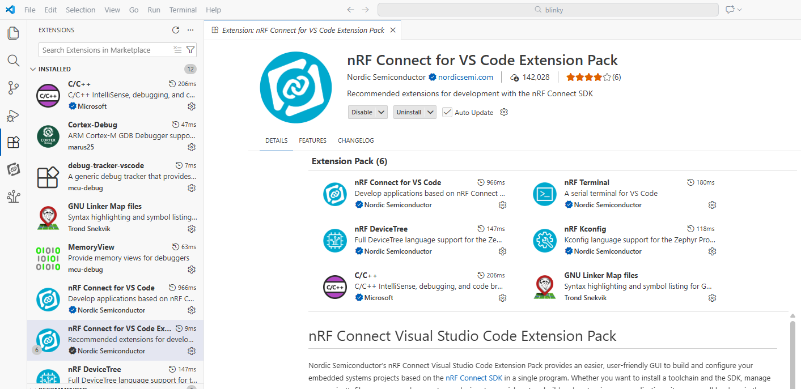

*Figure 19: nRF Connect for VS Code Extension Pack*

After installing the extension, click on the **nRF Connect icon**  that has been added to the sidebar, then click **Install SDK**.

Now select **Global** from the prompted dropdown menu. Then select the **nRF Connect SDK** and choose the **newest version**. Finally, enter a location for the SDK.

> :information_source: **IMPORTANT!**
>
> The **nRF Connect SDK is appr. 12 GB** in size. Make sure that your workstation has enough storage space at the desired location. Downloading, unpacking and installing the SDK will take a few minutes. The SDK will be stored in a directory called **`ncs`**.

Once the installation is complete, the message **Succesfully installed nRF Connect SDK** will be displayed. 

> :information_source: **Please note:**
>
> For the following steps we assume that you have copied our **[example project ("blinky")](blinky.zip)** on your workstation.

Click on the **nRF Connect icon** , click on **Open an existing application**, browse to the blinky folder and click on **Open**.

Now open the explorer in the sidebar and click on **BLINKY > vscode > settings.json**.

In the `settings.json` file edit the path to the `arm-zephyr-eabi-gdb.exe` in the **cortex-debug-gdbPath** variable. The path is the storage location of the nRF Connect SDK. In our example the SDK is stored in *`C:/ncs`*. 

> :information_source: **Please note:**
>
> Make sure to **escape the backslashes** in the path with another backslash, otherwise the path won't work.

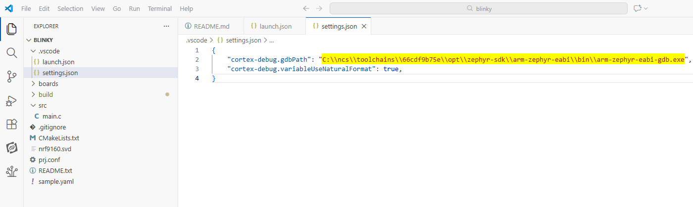

*Figure 20: Editing settings.json*

Open the `launch.json` and replace the current code with the following code:

```
{
    // Use IntelliSense to learn about possible attributes.
    // Hover to view descriptions of existing attributes.
    // For more information, visit: https://go.microsoft.com/fwlink/?linkid=830387
    "version": "0.2.0",
    "configurations": [
        {
            "name": "Flash & Debug",
            "cwd": "${workspaceFolder}",
            "executable": "./build/blinky/zephyr/zephyr.elf",
            "request": "launch",
            "type": "cortex-debug",
            "servertype": "external",
            "gdbTarget": "localhost:3210",
            "preLaunchTask": "nRF Connect: Build [incremental]: blinky/build",
            "overrideLaunchCommands": [
              "interpreter-exec console \"monitor swdp_scan\"",
              "interpreter-exec console \"attach 1\"",
              "interpreter-exec console \"set mem inaccessible-by-default off\"",
              "interpreter-exec console \"set remotetimeout 10\""
            ],
351352353354355356357358359360361362363364365366367368369370371372373374375376377378379380381382383384385386387388389390391392393394395396397398399400401402403404405406407408409410411412413414415416417418419420
            "postLaunchCommands": [
              "interpreter-exec console \"load\"",
            ],
            "svdFile": "nrf9160.svd"
        }, {
            "name": "Debug",
            "cwd": "${workspaceFolder}",
            "executable": "./build/blinky/zephyr/zephyr.elf",
            "request": "launch",
            "type": "cortex-debug",
            "servertype": "external",
            "gdbTarget": "localhost:3210",
            "showDevDebugOutput": "raw",
            "overrideLaunchCommands": [
              "interpreter-exec console \"monitor swdp_scan\"",
              "interpreter-exec console \"attach 1\"",
              "interpreter-exec console \"set mem inaccessible-by-default off\"",
              "interpreter-exec console \"set remotetimeout 10\""
            ],
            "svdFile": "nrf9160.svd"
        }
    ]
}
```

Now check whether the **path to the firmware file** in the **executable** variable is correct and, if necessary, edit the **localhost port** (displayed in the WRD/Client) in the **gdbTarget** variable.

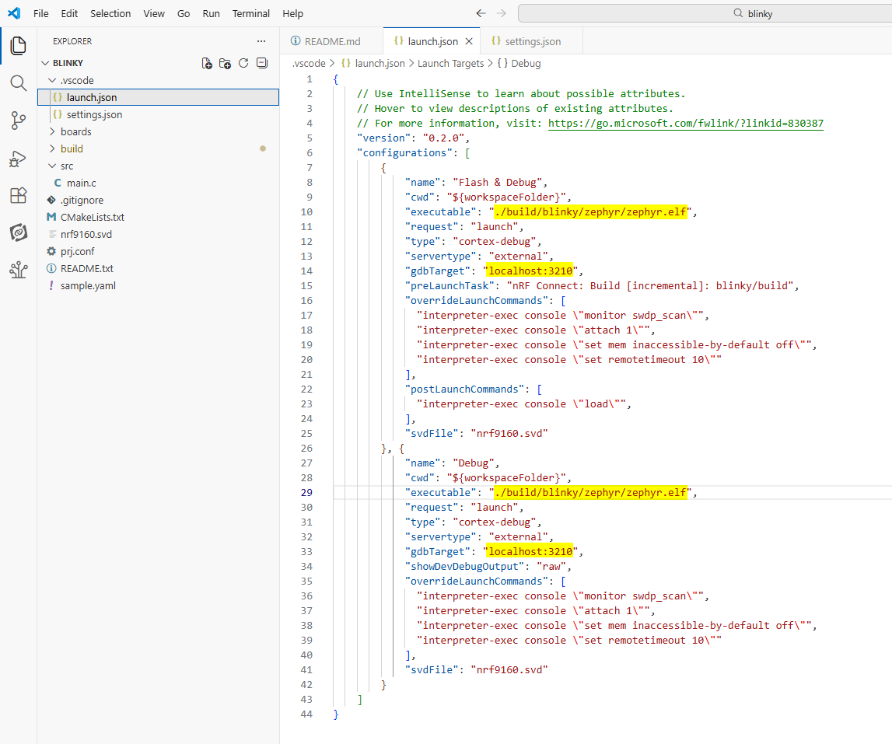

*Figure 21: Editing the launch.json file*

Click on the **nRF Connect icon** , open the **APPLICATIONS** section in the sidebar, open the **blinky folder** and hover over **build**. Then click on the **icon with the three dots** and select **Edit Build Configuration**.

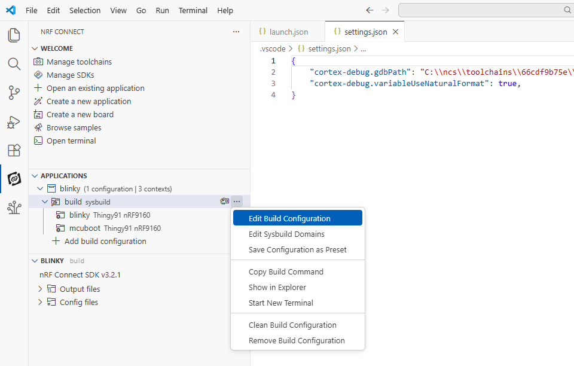

*Figure 22: Selecting Edit Build Configuration*

A new window opens in VSCode. Scroll down and click on the **`Generate and Build`** button.

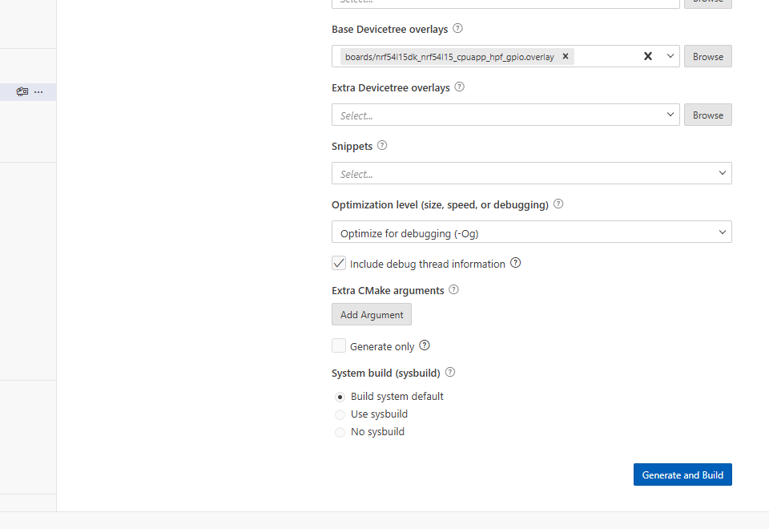

*Figure 23: Generate and Build button*

The building process will take a few moments.

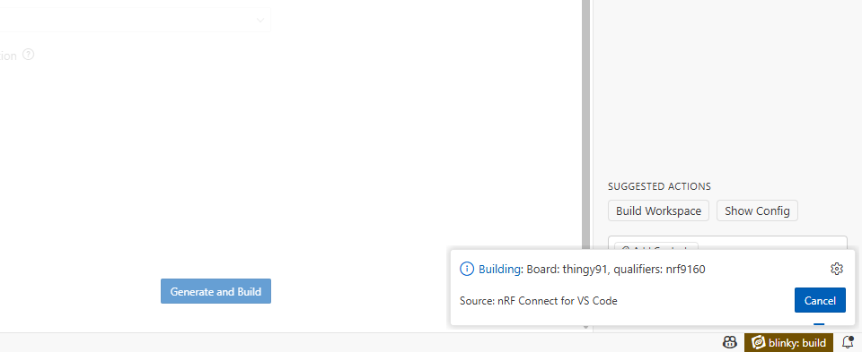

*Figure 24: Building process*

**Now everything is configured and you can start flashing and debugging your target device.**

# 9. DEBUGGING

## 9.1 Remote Flashing   

Our example project blinky offers a small script, to change the LED color of the Thingy:91.

Open the **explorer** sidebar and click on **BLINKY > src > main.c**.

Edit the **LED** variable in `main.c` and save the file.

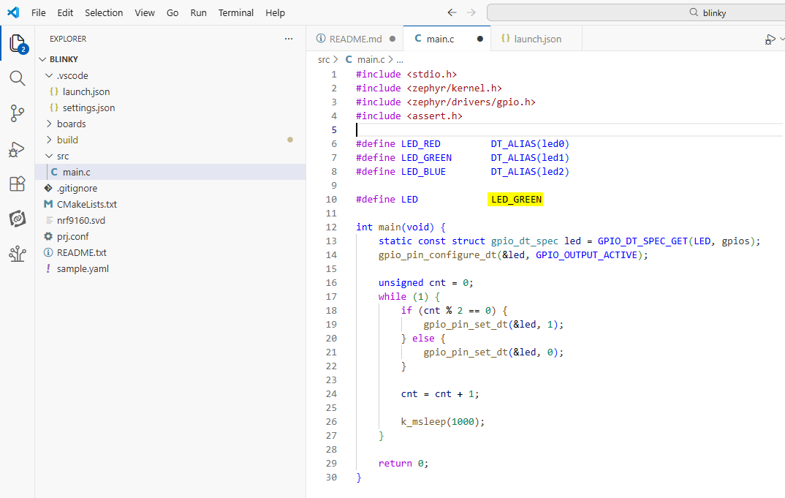

*Figure 25: Editing the main.c file*

Now open the **Run and Debug** sidebar and click the green play button.

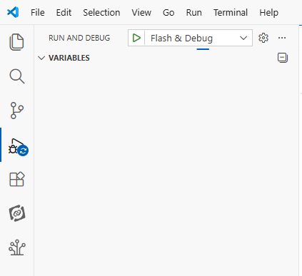

*Figure 26: Run and Debug sidebar with green play button*
421422423424425426427428429430431432433434435436437438439440441442443444445446447448449450451452453454455456457458459460461462463464465466467468469470471472473474475476477478479480481482483484485486487488489490

> :information_source: **IMPORTANT!**
>
> Please disable the **GDB Server in the WRD/Client** and then enable it every time before you flash the target! This ensures that the WRD/Probe is always in a defined state when flashing the target. So if the error message **"Failed to launch GDB..."** appears, disable the GDB Server in the WRD/Client and then enable it, and try again. Edit the **localhost port** in the `launch.json` file if necessary.

The flashing should only take a few seconds. If everything worked, the LED of the Thingy:91 will blink in the desired color and the **target firmware fingerprint** of the new firmware will be displayed in the WRD/Client.

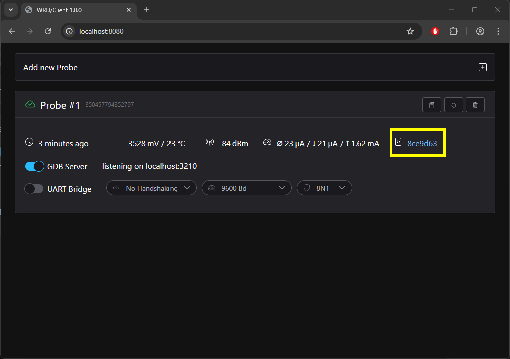

*Figure 27: Target firmware fingerprint in the WRD/Client*

## 9.2 Remote Reset

To reset the target device, simply click the `Reset` button.

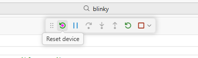

*Figure 28: Reset button in VSCode*

## 9.3 Remote Power Cycling

This function will be available with the next WRD/Probe firmware update.

## 9.4 External Watchdog for Target

This function will be available with the next WRD/Probe firmware update.

# 10. CHECKING REMAINING DATA VOLUME

+  **Data volume:** Click this button to check the remaining data volume on the WRD/Probe SIM card. An email will be sent to **cellular@ssv-embedded.de**, and you will receive a reply at the email address you provided.

## 10.1 Ordering more Data Volume

Please use the email adddress **cellular@ssv-embedded.de** to order additional data volume.

# 11. MEANING OF LED STATUS

The WRD/Probe uses an RGB LED as indicator to give the user some information about the current status/operating mode of the WRD/Probe. The following tables explain the meaning of the different LED states.

## 11.1 Normal Mode

There is no user interaction with the WRD/Probe.

| LED STATUS | MEANING |
| --- | --- |
|  **PURPLE </br> Slowly&nbsp;pulsating** | The WRD/Probe boots up and connects to the mobile network. |
|  **RED </br> 4x&nbsp;rapid&nbsp;flashing** |  Connection to the mobile network could not be established. The WRD/Probe will try again at a later time. |
|  **BLUE </br> Flash&nbsp;once** | TX or RX with the mobile network. |
|  **PURPLE </br> Rapidly&nbsp;pulsating** | The WRD/Probe performs an update that was started by the WRD/Client. The WRD/Probe must not be switched off in this state! |

*Table 1: Meaning of the LED states in normal mode*

## 11.2 Charging Mode

The WRD/Probe is charged via the USB-C interface.

| LED STATUS | MEANING |
| --- | --- |
|  **GREEN </br> Slowly&nbsp;pulsating** |  The WRD/Probe is being charged. |
|  **GREEN </br> Shine&nbsp;permanently** | The WRD/Probe is fully charged. The USB-C cable can be unplugged. |
|  **RED </br> Slowly&nbsp;pulsating** | The WRD/Probe cannot be charged. The power switch is off or the battery is defective. |

*Table 2: Meaning of the LED states in charging mode*

## 11.3 Pairing Mode

The `user` button was pressed for 4 seconds.

| LED STATUS | MEANING |
| --- | --- |
491492493494495496497498499500501502503504505506507508509510511512513514515516517
|  **CYAN </br> Slowly&nbsp;pulsating** | The WRD/Probe searches for a flicker code. Hold the WRD/Probe with the photo transistor against the flicker code field on the screen. |
|  **CYAN </br> Rapidly&nbsp;pulsating** | The WRD/Probe reads the flicker code. Keep the WRD/Probe on the field with the flicker code. Hold the WRD/Probe still and make sure that the screen brightness does not change. |
|  **GREEN </br> 4x&nbsp;rapid&nbsp;flashing** | The pairing was successful. You can remove the WRD/Probe from the flicker code field and complete the pairing in the WRD/Client. |
|  **RED </br> 4x&nbsp;rapid&nbsp;flashing** | The pairing has failed. You can try again by pressing and holding the `user` button for 4 seconds. If the pairing fails several times, please try using a different PC for the pairing. |

*Table 3: Meaning of the LED states in pairing mode*

## 11.4 LTE-M Connection Status

The `user` button was pressed briefly.

| LED STATUS | MEANING |
| --- | --- |
|  **RED </br> Shine&nbsp;permanently** | No connection to the mobile network has been established. Ensure that the antenna is connected correctly and that there is LTE-M coverage at the installation site (see **[coverage map on the WRD/Probe website](https://www.ssv-embedded.de/en/wrdprobe/#ltem)**). |
|  **YELLOW </br> Shine&nbsp;permanently** | There is a connection to the mobile network, but reception is weak. Ensure that the antenna is correctly connected and properly aligned. |
|  **GREEN </br> Shine&nbsp;permanently** | There is a good connection to the mobile phone network. |

*Table 4: Meaning of the LED states for the LTE-M connection status*

# 12. HELPFUL LITERATURE

+ [Hardware Reference WRD/Probe (PDF)](https://ssv-embedded.de/doks/manuals/hr_wrd_probe_en.pdf)
+ [VSCode](https://code.visualstudio.com/)
---

*author: wbu // review: bve // 24-02-2026 // rev. 1.0*
