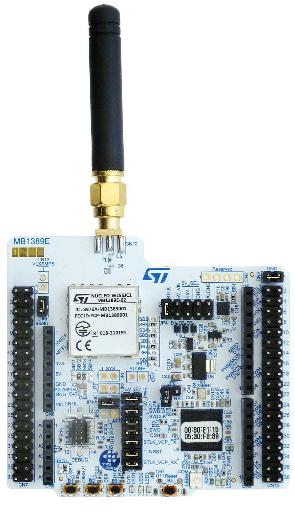
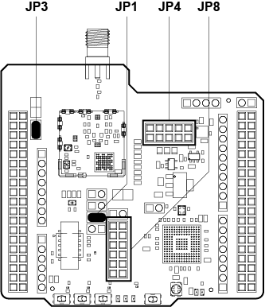
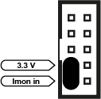
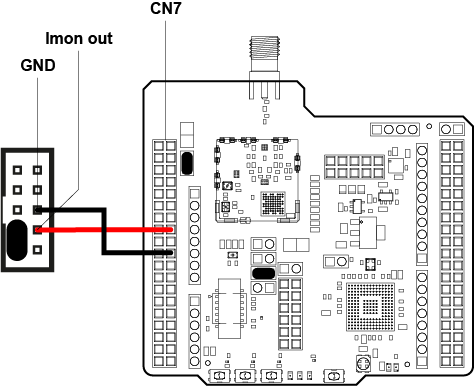
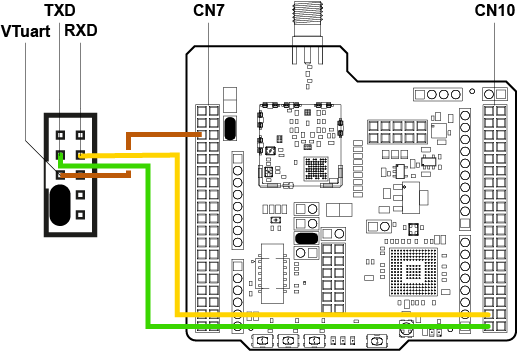
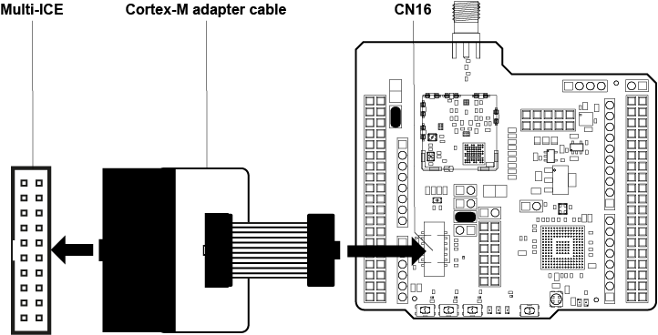

# WRD/PROBE HOW TO

## Connecting an STM32 NUCLEO-WL55JC2

# 1. INTRODUCTION

This document describes how to connect the **STM32 NUCLEO-WL55JC2** evaluation board to the **WRD/Probe** for external 3.3 V power supply, power monitoring, UART communication and debugging.

## 1.1 Required Equipment

The following equipment is required to work with the WRD/Probe:

+ 1x Cortex-M adapter*
+ 1x Jumper cable set*

*Part of the WRD/Probe scope of delivery.

# 2. PREPARATIONS

## 2.1 Prepare the STM32 NUCLEO-WL55JC2

Set the following jumpers:

+ Set **JP1**
+ Set **JP3 / BOOT0**
+ Remove all jumpers from **JP4** (This disables the internal ST-LINK power connection.)

For debugging via the WRD/Probe:

+ Remove all jumpers from **JP8** (This disconnects the onboard ST-LINK debug interface.)

*Figure 1: STM32 NUCLEO jumper settings*

## 2.2 Prepare the WRD/Probe

Set a jumper on **3.3V and Imon In** of the UART interface.

*Figure 2: UART interface with jumper on 3.3V and Imon In*

# 3. CONNECTIONS

## 3.1 Power Supply via WRD/Probe

The NUCLEO-WL55JC2 is powered externally with **3.3 V** via the WRD/Probe. The current can be monitored through the **Imon** path.

See also **[section 7.1.5: Target with Power Supply via WRD/Probe @3.3 V and Power Monitoring](https://github.com/SSV-embedded/WRD-Probe/blob/main/README.md#715-target-with-power-supply-via-wrdprobe-33-v-and-power-monitoring)** in the WRD/Probe First Steps.

Connect the power lines with jumper cables:

| WRD/Probe | NUCLEO-WL55JC2           | Function     |
| --------- | ------------------------ | ------------ |
| Imon Out  | CN7 Pin 16               | 3.3 V supply |
| GND       | CN7 Pin 20 or CN7 Pin 22 | Ground       |

*Table 1: Connections for power supply*

*Figure 3: Connections for power supply*

## 3.2 UART Connection

Connect UART between WRD/Probe and NUCLEO-WL55JC2 with jumper cables.

| WRD/Probe | NUCLEO-WL55JC2    |
| --------- | ------------------|
| RXD       | CN10 Pin 35 (TXD) |
| TXD       | CN10 Pin 37 (RXD) |

*Table 2: UART connection*

Set the UART voltage level to **3.3 V**:

| WRD/Probe | NUCLEO-WL55JC2      |
| --------- | --------------------|
| VTuart    | CN7 Pin 5 (VDD_MCU) |

*Table 3: UART voltage level settings*

*Figure 4: UART connection*

## 3.3 Debug Connection

+ On the NUCLEO-WL55JC2 remove all jumpers from **JP8**.
+ Connect the **Cortex-M adapter cable** to the **Multi-ICE** interface of WRD/Probe and to **CN16** of the NUCLEO-WL55JC2

| WRD/Probe              | NUCLEO-WL55JC2 |
| ---------------------- | -------------- |
| Multi-ICE interface    | CN16           |

*Table 4: Debug connection with Cortex-M adapter cable*

*Figure 5: Debug connection*

## 3.4 Checklist Before Power-On

* External supply is **3.3 V only**
* Common ground is connected
* **JP1** and **JP3 / BOOT0** are set
* All jumpers removed from **JP4**
* All jumpers removed from **JP8**
* UART TX/RX lines are crossed correctly
* **VTuart** is connected to **VDD_MCU / 3.3 V**
* Cortex-M adapter cable is connected to **CN16**

# 4. HELPFUL LITERATURE

+ [First Steps WRD/Probe (GitHub)](https://github.com/SSV-embedded/WRD-Probe)
+ [Hardware Reference WRD/Probe (PDF)](https://ssv-embedded.de/doks/manuals/hr_wrd_probe_en.pdf)
+ [User Manual STM32WL Nucleo-64 board (PDF)](https://www.st.com/resource/en/user_manual/um2592-stm32wl-nucleo64-board-mb1389-stmicroelectronics.pdf)

---

*author: wbu // review: ssc // 02-06-2026 // rev. 1.0*
